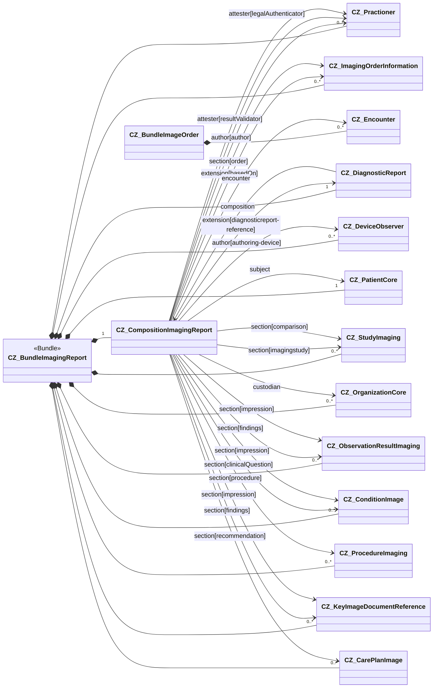

Na následující stránce naleznete poznámky k implementaci zprávy z obrazového vyšetření. Týkají se tvorby bundlu, kompozice a naplnění těchto profilů příslušnými daty.

### Přehled obsahu

Obrazová zpráva je reprezentována jako FHIR bundle, který obsahuje zdroje CZ_CompositionImagingReport a CZ_DiagnosticReport a všechny zdroje ve stromové struktuře zdrojů, na které se odkazovalo (viz [$document operation](https://www.hl7.org/fhir/composition-operation-document.html)). Při implementaci je nutné se řídit závaznými pravidly, které jsou popsány v sekci [Obligations](obligations-cs.html)

### Popis obsahu CZ_CompositionImagingReport

